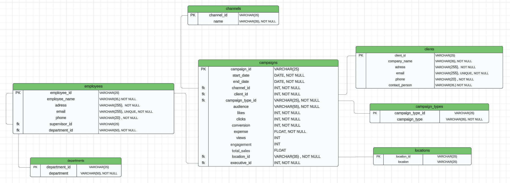

# ERD

This folder contains the **Entity-Relationship Diagram (ERD)** that serves as the backbone of the Marketflash database design. The ERD was developed after a meeting with **Markus**, the owner of Marketflash, to understand the company's data needs, reduce redundancy, and enhance data accessibility for decision-making.

### Entity-Relationship Diagram:

### Design Approach:
- **Normalization**: The ERD was designed to reduce redundancy by organizing data into separate, well-structured tables.
- **Consistency**: Naming conventions were standardized across tables and columns for clarity and consistency.
- **Referential Integrity**: Primary and foreign keys were used to establish relationships, ensuring that the data in one table is linked accurately to data in another.
- **Scalability**: The ERD is built to accommodate potential future data growth and evolving business needs.

### Key Design Elements:
- **Departments & Employees**: Tracks department assignments and supervisor relationships within the company.
- **Campaigns & Channels**: Details on marketing campaigns, including performance metrics across various channels and audience segments.
- **Clients & Locations**: Stores client data with information on geographical location, enabling location-based analysis.
- **Campaign Types**: Differentiates types of campaigns (e.g., Sales, Brand Awareness) to provide insights on campaign focus and strategy.

### Next Steps:
The ERD serves as the foundation for the SQL database creation. With the ERD as a reference, we implemented SQL scripts to:
- Create each table with the defined structure and constraints.
- Insert initial data for testing.
- Test relationships using SQL JOIN statements to verify that each link between tables is functioning as expected.

This ERD forms a roadmap for data flow, from raw storage to actionable insights, which will ultimately be visualized in the Marketflash dashboard.
