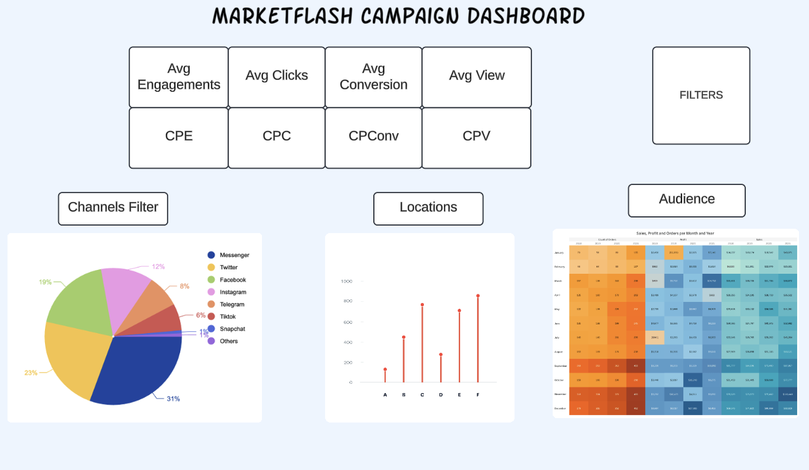

# Mockup-Design

This folder contains the initial mockup design for the Marketflash Campaign Dashboard. The mockup was created after meeting with Markus, the owner of Marketflash, to discuss the business's dashboard requirements and key metrics. This preliminary design reflects the essential components and KPIs identified during the meeting, ensuring alignment with the business’s needs.

### Mockup Contents:
- **Visual Layout**: The mockup provides a visual structure of the dashboard, including areas dedicated to key performance indicators (KPIs) such as Average Engagements, Clicks, Conversions, and Views.
- **Filters and Comparisons**: Markus emphasized the importance of being able to filter and compare campaigns by specific attributes such as Channel, Audience, and Location. This mockup includes placeholders for these filters, supporting the intended interactive experience.
- **Charts and Graphs**: Basic visual elements, like pie charts for channel distribution and bar graphs for location performance, are incorporated to give an overview of data insights that will be further developed in the final dashboard.

### Purpose:
The **Mockup-Design** serves as a blueprint for the final dashboard, capturing the business's analytics needs and visual preferences. It provides a foundation that will guide the creation of the interactive Tableau dashboard, ensuring that all necessary metrics and features are included to help Markus and his team analyze past campaign performance and make informed decisions for future campaigns.

### Mockup Image:

---

This mockup ensures that the final dashboard aligns with Marketflash's goals, helping the team to understand campaign effectiveness across different dimensions, such as channels, audience types, and locations.

### Click on the icon below to see the next step:

