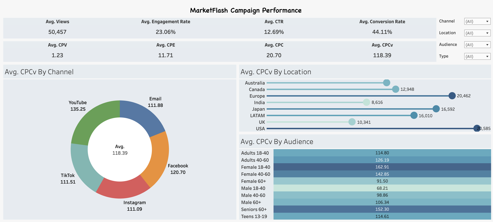

# MarketFlash Campaign Dashboard

Welcome to the **MarketFlash Campaign Dashboard**! This dashboard provides powerful insights into campaign performance, allowing Markus and his team at MarketFlash to make data-driven decisions and optimize their marketing strategies.

### Dashboard Features
The dashboard offers a comprehensive view of key metrics and allows for filtering across multiple dimensions:

- **Filters**: Select specific **Channel**, **Location**, **Audience**, and **Campaign Type** to drill down and analyze campaign data based on the chosen criteria.
- **KPIs**: Displays essential metrics, including Average Views, Engagement Rate, Conversion Rate, Cost Per View (CPV), and other insights crucial for evaluating campaign effectiveness.
- **Visualizations**:
  - **Channel Performance**: A breakdown of CPCv (Cost Per Conversion View) by channel, showing which platforms yield the most efficient results.
  - **Location Performance**: A visualization of CPCv by location, helping to identify regional strengths.
  - **Audience Insights**: A heatmap of CPCv by audience segments, aiding in targeted strategy adjustments.

Each of the three visualizations (Channel, Location, and Audience) offers additional insights upon hovering. When you hover over any element in these visualizations, detailed **Cost Per** metrics, including **CPC**, **CPV**, **CPCv**, and **CPE**, are displayed, providing a more granular view of campaign performance across various dimensions.

### Interactive Dashboard
Explore the live dashboard on Tableau by clicking the icon below:

This dashboard is designed to empower MarketFlash's executives with the ability to easily interpret past campaign results, compare performance across different channels, locations, and audiences, and leverage these insights for strategic planning.
